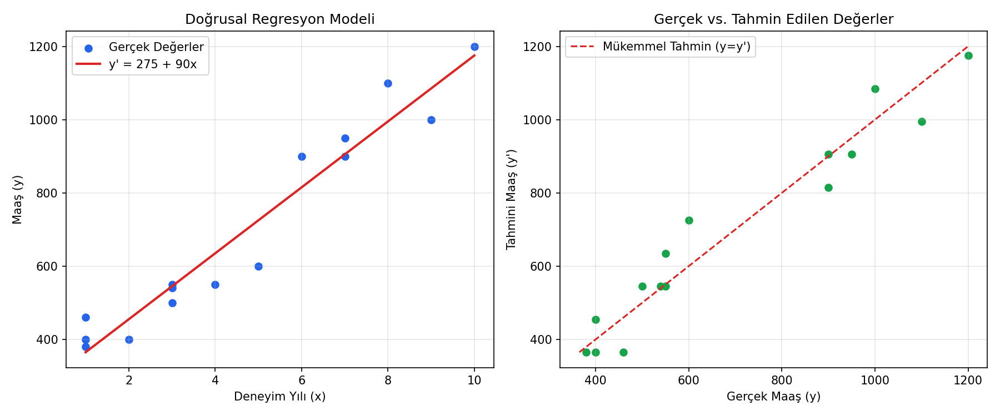

# Regresyon Modelleri için Hata Değerlendirme

Miuul **Data Scientist Bootcamp** kapsamında verilen "Regresyon Modelleri için Hata
Değerlendirme" ödevinin çözümüdür. Basit bir doğrusal regresyon modelinin başarısı
**MSE**, **RMSE** ve **MAE** metrikleri ile değerlendirilmiştir.

## 📌 Problem

Çalışanların deneyim yılı (x) ve maaş (y) bilgileri verilmiştir.

1. Verilen bias (b) ve weight (w) değerlerine göre doğrusal regresyon model
   denklemi oluşturulur: **y' = b + w·x**  (Bias = 275, Weight = 90)
2. Bu denklem ile tablodaki tüm deneyim yılları için maaş tahmini yapılır.
3. Modelin başarısı MSE, RMSE ve MAE skorları ile ölçülür.

| Deneyim Yılı (x) | Maaş (y) |
|:---:|:---:|
| 5 | 600 |
| 7 | 900 |
| 3 | 550 |
| 3 | 500 |
| 2 | 400 |
| 7 | 950 |
| 3 | 540 |
| 10 | 1200 |
| 6 | 900 |
| 4 | 550 |
| 8 | 1100 |
| 1 | 460 |
| 1 | 400 |
| 9 | 1000 |
| 1 | 380 |

## 🧮 Kullanılan Formüller

```
Model Denklemi :  y' = b + w·x

MSE  = (1/n) · Σ (yᵢ − ŷᵢ)²
RMSE = √MSE
MAE  = (1/n) · Σ |yᵢ − ŷᵢ|
```

## ✅ Sonuçlar

Model denklemi: **y' = 275 + 90·x**

| Metrik | Değer |
|---|---:|
| Gözlem Sayısı (n) | 15 |
| MSE | 4438.33 |
| RMSE | 66.62 |
| MAE | 54.33 |

Sonuçlar `scikit-learn`'in `mean_squared_error` ve `mean_absolute_error`
fonksiyonları ile de doğrulanmıştır (bkz. `src/main.py`).

**Yorum:** RMSE (≈66.6), MAE'ye (≈54.3) göre daha yüksek çıkmıştır. Bu durum,
RMSE'nin hataları karesini alarak hesaplaması nedeniyle büyük hatalara (bu veri
setinde en büyük hata −125 TL, x=5 gözleminde) MAE'den daha fazla ağırlık
vermesinden kaynaklanır. Model, ortalamada maaşları gerçeğe yakın tahmin
etmekle birlikte bazı gözlemlerde (özellikle deneyim yılı 5 ve 6 olanlarda)
sapma göstermektedir.

Detaylı gözlem bazlı tahmin/hata tablosu: [`outputs/tahmin_sonuclari.csv`](outputs/tahmin_sonuclari.csv)



## 📁 Proje Yapısı

```
regresyon-hata-degerlendirme/
├── data/
│   └── calisan_maas.csv         # Ham veri seti
├── outputs/
│   ├── tahmin_sonuclari.csv     # Tahmin ve hata tablosu (script çıktısı)
│   └── regresyon_grafik.png     # Regresyon doğrusu ve tahmin grafikleri
├── src/
│   └── main.py                  # Çözüm kodu
├── .gitignore
├── LICENSE
├── README.md
└── requirements.txt
```

## ▶️ Nasıl Çalıştırılır

```bash
git clone <repo-url>
cd regresyon-hata-degerlendirme
pip install -r requirements.txt
python src/main.py
```

Script, sonuç tablosunu ve hata metriklerini konsola yazdırır; ayrıca
`outputs/` klasörüne bir CSV tablosu ve bir grafik dosyası kaydeder.

## 🛠️ Kullanılan Teknolojiler

- Python 3
- pandas / numpy
- matplotlib
- scikit-learn (doğrulama amaçlı)

## 📄 Lisans

Bu proje [MIT Lisansı](LICENSE) ile lisanslanmıştır.

---
*Bu çözüm, [Miuul](https://www.miuul.com) Data Scientist Bootcamp ödev materyaline
dayanmaktadır; ödev kaynağı Miuul'a aittir, çözüm bana aittir.*
